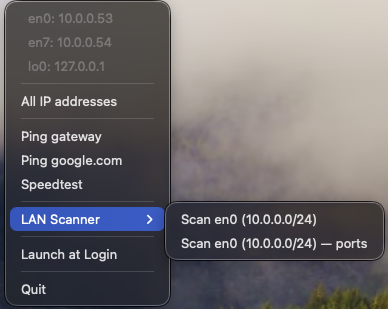

# LAIN-tools

A macOS menu bar app for network information, connectivity tests, and LAN discovery. Shows your primary IP (or an icon), lists all interfaces, runs ping and speedtests in Terminal, and scans local subnets for hosts and open ports.

**Requirements:** macOS, Python 3.7+



---

## Features

- **Menu bar display** — Shows your primary (highest-priority, non-VPN) IPv4 address, or a custom icon if you add `icon.png`. VPN, bridge, and tunnel interfaces are ignored so you see your real LAN IP.
- **All IPs in the menu** — Dropdown lists every IPv4 address by interface (primary first); no need to open a dialog for a quick glance.
- **Ping gateway** — Opens Terminal and pings your default gateway (from `route -n get default`).
- **Ping google.com** — Opens Terminal and pings `google.com`.
- **Speedtest** — Opens Terminal and runs a download/upload speed test via `speedtest-cli` (uses the same Python as the app so your venv dependencies are used).
- **LLDP neighbors** — Opens Terminal and runs `lldpcli show neighbors` so you can see connected switches, routers, and other LLDP-capable devices (system name, chassis ID, port, etc.). Requires [lldpd](https://formulae.brew.sh/formula/lldpd) to be installed and running (`brew install lldpd` then `sudo brew services start lldpd`). May prompt for your password (sudo).
- **LAN Scanner** — Per-interface subnet scan with two modes:
  - **Hosts** — Ping sweep, then show **IP**, **MAC** (from ARP), and **hostname** (reverse DNS / mDNS).
  - **Ports** — Same sweep, then show **IP**, **MAC**, and **open TCP ports** (21, 22, 23, 80, 443, 445, 631, 3306, 3389, 5353, 8080, 9100, 62078).

Ping, Speedtest, and LAN Scanner all run in a new Terminal window so you can see live output and keep the menu bar app lightweight.

---

## Installation

1. **Clone the repo**
   ```bash
   git clone https://github.com/YOUR_USERNAME/LAIN-tools.git
   cd LAIN-tools
   ```

2. **Create a virtual environment and install dependencies**
   ```bash
   python3 -m venv venv
   source venv/bin/activate
   pip install -r requirements.txt
   ```

3. **Run the app**
   ```bash
   python lain_tools.py
   ```

The app stays in the menu bar until you choose **Quit**.

---

## Run as an app (recommended) and Launch at Login

To get a **double-clickable app** and the **Launch at Login** menu option:

### Build requirements

- **Xcode Command Line Tools** — Required so the build can compile **psutil** from source inside the app (the pre-built wheel can fail to load when run from an app bundle). If you don’t have them:
  ```bash
  xcode-select --install
  ```
- You must have already set up the project: clone, create venv, and `pip install -r requirements.txt` (see [Installation](#installation)). The build script uses your project’s venv Python to create a fresh venv inside the app.

### Building the app

1. From the project directory, run:
   ```bash
   ./build_app.sh
   ```
   The script:
   - Creates **LAIN-tools.app** in the same folder.
   - Puts a new virtual environment inside the app and installs **rumps** and **speedtest-cli**.
   - Builds **psutil** from source (`pip install --no-binary psutil psutil`) so the C extension matches the app’s Python and path and loads correctly in the bundle.
   The first build can take a minute while psutil compiles. When it finishes, the app opens automatically.

2. **Run the app** — After building, the app should open on its own. You can also double-click **LAIN-tools.app**, or drag it to **Applications** and open it from there.

   **If the app doesn’t start:**
   - **Right-click** the app → **Open** to get past macOS Gatekeeper the first time.
   - If it still fails, an alert shows the error (e.g. missing Python or an import traceback). Fix the cause (e.g. install Command Line Tools if you see a compiler error) and run `./build_app.sh` again.

3. **Launch at Login** — When running from the .app, the menu shows **Launch at Login**. Turn it on (checkmark) to start LAIN-tools when you log in; turn it off to remove it from Login Items. A notification confirms the change.

If you run `python lain_tools.py` from the terminal instead of the .app, the “Launch at Login” item does not appear (it only works when the app is run as the .app bundle).

---

## Menu structure

| Item | Description |
|------|-------------|
| **IP list** (top) | Non-clickable list: `interface: IP` for each interface; primary IP’s interface is first. |
| **All IP addresses** | Dialog with the same list, with “(primary)” beside the primary IP. |
| **Ping gateway** | Terminal: ping default gateway, then “Press Enter to close…”. |
| **Ping google.com** | Terminal: ping google.com. |
| **Speedtest** | Terminal: run `speedtest-cli` (download/upload). |
| **LLDP neighbors** | Terminal: `lldpcli show neighbors` (requires lldpd; see below). |
| **LAN Scanner** | Submenu with one or two entries per available network (see below). |
| **Launch at Login** | (Only when running as .app.) Toggle to start the app when you log in. |
| **Quit** | Exits the app. |

---

## LLDP neighbors

The **LLDP neighbors** menu item opens Terminal and runs `sudo lldpcli show neighbors`, which lists devices that speak LLDP on your link (e.g. switch, router, access point): system name, chassis ID (MAC), port ID/description, management address, capabilities, TTL.

**Requirements:**

- **lldpd** is not included with macOS. Install and start it with Homebrew:
  ```bash
  brew install lldpd
  sudo brew services start lldpd
  ```
- The command runs with `sudo`, so Terminal will prompt for your password when you use **LLDP neighbors**.

If lldpd is not installed or not running, the Terminal window will show an error (e.g. `command not found` or connection refused).

---

## LAN Scanner

The **LAN Scanner** submenu is built from your current interfaces that have an IPv4 subnet (Ethernet, Wi‑Fi, Thunderbolt, etc.). Bridge and VPN interfaces are excluded.

For each such network you get two options:

- **Scan &lt;name&gt; (&lt;CIDR&gt;)** — Discovers hosts with ping, then shows **IP**, **MAC** (from the ARP table), and **hostname** (reverse DNS / mDNS). Results open in Terminal, sorted by IP.
- **Scan &lt;name&gt; (&lt;CIDR&gt;) — ports** — Same discovery, then for each host runs a TCP connect scan on common ports and shows **IP**, **MAC**, and **open ports**.

Example: **Scan Ethernet (192.168.1.0/24)** and **Scan Ethernet (192.168.1.0/24) — ports**.

The scan logic lives in `lan_scan.py`, which you can also run by hand:

```bash
python lan_scan.py 192.168.1.0/24           # hosts: IP, MAC, hostname
python lan_scan.py 192.168.1.0/24 --ports  # hosts: IP, MAC, open ports
```

---

## Optional: menu bar icon

If you place a PNG named **`icon.png`** in the same directory as `lain_tools.py`, the menu bar will show only that icon (no IP text). Without it, the app shows the primary IP as text (with a smaller font when possible).

- Recommended size: **22×22** or **44×44** pixels for retina.
- The file is included in the repo by default; remove it or add `icon.png` to `.gitignore` if you don’t want to commit it.

---

## Behaviour details

- **Primary IP** — Uses macOS network service order (`networksetup -listnetworkserviceorder`). The first interface that has an IPv4 address and is not VPN/bridge/tunnel (e.g. not `utun`, `ppp`, `ipsec`, `bridge`) is used. If that fails, the app falls back to the first non-ignored interface from `psutil`, then to the usual “connect to 8.8.8.8” method.
- **Ignored interfaces** — Everywhere (primary IP, IP list, LAN Scanner), interfaces whose names start with `utun`, `ppp`, `ipsec`, or `bridge` are skipped.
- **Refreshes** — The menu bar title (or icon) and the dropdown IP list are refreshed every 3 seconds.

---

## Project layout

```
LAIN-tools/
├── lain_tools.py      # Main menu bar app
├── lan_scan.py        # Subnet scanner (hosts + optional ports)
├── requirements.txt   # Python dependencies
├── build_app.sh       # Builds LAIN-tools.app (run ./build_app.sh)
├── .gitignore
├── icon.png          # Optional; omit to show IP text in menu bar
├── ip_test.py         # Standalone IP test script (optional)
├── connection_test.py # Standalone connection test (optional)
└── LAIN-tools.app/   # Created by build_app.sh; double-click to run
```

---

## Dependencies

- **psutil** — Network interfaces and addresses. In the built .app, it is installed from source so the C extension loads correctly inside the bundle.
- **rumps** — Menu bar app (uses PyObjC/Cocoa).
- **speedtest-cli** — Used when you run **Speedtest** from the menu.

---

## License

Use and modify as you like. If you redistribute, attribution is appreciated.
